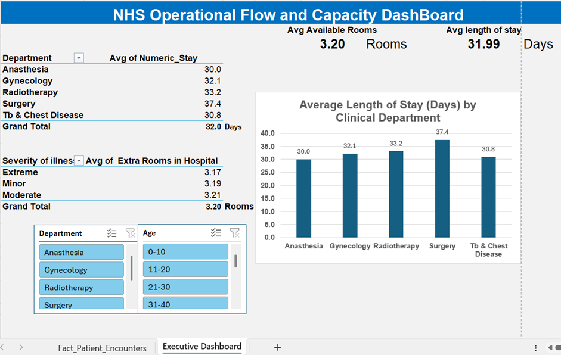

## NHS Hospital Operational Flow & Bed Capacity Dashboard
## 📌 Project Background & Scenario
An NHS hospital emergency department is experiencing chronic bottlenecks, causing significant delays in patient admissions, bed blocking, and an increased risk of breaching the standard NHS 4-hour target.
This business intelligence project mimics operational logic found in trust tracking systems (e.g., NerveCentre) to identify capacity constraints. The objective is to provide hospital site managers, operational directors, and system analysts with live data-driven insights to streamline patient flow from arrival through admission, ward allocation, and eventual discharge.
------------------------------
## 🛠️ Technical Architecture & ETL Pipeline
The project implements a resilient data engineering pipeline natively in Microsoft Excel using Power Query, purposefully built to automate manual workflows and eliminate common spreadsheet data-type corruption traps.

[Raw Kaggle CSV] ➔ [Power Query Ingestion] ➔ [Text Normalization] ➔ [Conditional Logic Midpoints] ➔ [Unified Memory Cache] ➔ [Cross-Filtered Dashboard Canvas]

   1. Extraction: Connected directly via a live file stream to a flat transactional dataset containing 318,438 records of historical patient admissions (Fact_Patient_Encounters).
   2. Transformation (Power Query Engine):
   * Data Type Enforcement: Explicitly declared the Stay and Age categories as Text fields prior to data loading. This prevented Excel's automatic rendering engine from corrupting text 	intervals into erroneous calendar dates (e.g., stopping "11-20" from mapping to "Nov-20").
      * Conditional Logic Midpoints: Built a multi-clause conditional column (Numeric_Stay) to map qualitative text brackets to discrete numeric integers (e.g., "0-10" → 5, "11-20" → 15, 	"21-30" → 25). This unlocked the ability to calculate statistical averages across massive datasets without modifying the source structure.
      * Text Standardization: Applied global Capitalize Each Word formulas across care departments to standardize reporting names and guarantee a polished visual presentation on front-end 	charts.
   3. Loading: Loaded the clean, optimized dataset directly into a single In-Memory Data Cache. By driving multiple downstream components from one centralized query stream, workbook file 	sizes were significantly optimized, and processing speeds were dramatically increased.

------------------------------
## 📊 Core Performance Metrics & Dashboard Blueprint

* Executive KPI Cards:
* Average Available Rooms (3.20 Rooms): A macro-level operational buffer metric tracking remaining physical bed capacity.
   * Average Length of Stay (31.99 Days): The primary outcome metric calculating the exact baseline time an inpatient occupies a hospital bed.
* Clinical Specialty Matrix: An aggregated breakdown mapping precise mean length of stay (LOS) values directly to responsible care lines (Anesthesia, Gynecology, Radiotherapy, Surgery, TB & Chest Disease).
* Bed Capacity Risk Profile: A table calculating real-time resource availability against initial patient clinical severities (Extreme, Minor, Moderate).
* Multi-Linked Slicer Filters: Configured interactive cross-filtering slices for Department and Age Demographics (e.g., 0-10, 11-20). These filters are unified across the background cache, allowing users to drill down into localized hospital pressure points instantly.

------------------------------
## 💡 Key Operational Insights & Executive Summary

* The Surgical Bottleneck Outlier: While the hospital-wide average length of stay sits at roughly 32 days, the Surgery Department exhibits a severe outlier duration of 37.4 days—the longest in the entire trust. This explicitly flags the surgical ward path as the primary structural constraint preventing smooth emergency department admissions.
* Decoupled Capacity vs. Clinical Severity: Analytical findings demonstrate that physical bed availability remains almost completely static regardless of initial clinical urgency, averaging 3.17 available rooms for Extreme cases, 3.19 for Minor, and 3.21 for Moderate. This indicates that hospital gridlock is an operational flow issue driven by delayed discharges and clinical processing times within specific specialties, rather than a heavy influx of higher-acuity emergency cases.

------------------------------

